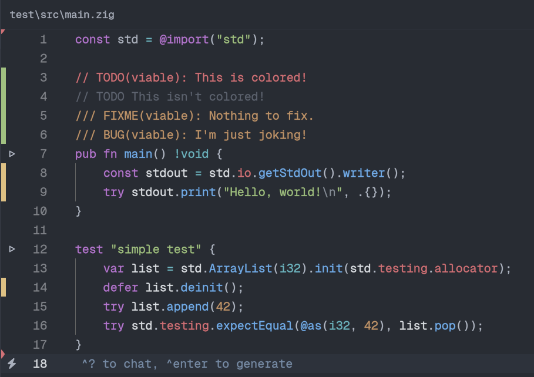

# zed-zig
First class Zig support for the [Zed Editor](https://github.com/zed-industries/zed)



## Prerequisites
- Zed 0.162.0 or newer
- Zig binary in path or configured in settings.json

## Features
- Supports master releases of zls
- Predefined tasks for build, test, run
- Runnable Code Detection
  - Displays clickable run buttons (▶️)
  - One-click execution for main functions and individual tests
- Ability to add custom zls forks
- Support custom provider or: [[zigscient](https://github.com/llogick/zigscient) | zls-stable | zls-master]
- Workspace independent configuration ( `.zed/settings.json` in project root)
- TODO and other comment highlight improvements

## Installation

1. Clone this repository
2. Open extensions tab in Zed
3. Click on Install Dev Extension
4. Select the cloned repository

## Configuration
### Both providers use the same configuration file.
Create it in your project rootdirectory under `.zed/settings.json`.
Or directly in your Zed's global `settings.json`.

```json
{
    "languages": {
        "Zig": {
            "code_actions_on_format": {
                "source.fixAll": true,
                "source.organizeImports": true
            }
        }
    },
    "lsp": {
        "zls": {
            "settings": {
                /// Language server provider to use.
                /// Not needed if custom binary provided.
                /// Available providers:
                ///   - zls (default, latest)
                ///   - zls-stable (latest release on github)
                ///   - zigscient
                ///   - custom (WIP)
                "provider": "zls"
            },
            "initialization_options": {
                /// automatically discards values and more
                /// for zigscient this is `enable_autofix`
                /// for zls this is `force_autofix` or `source.fixAll` in `code_actions_on_format`
                "enable_autofix": true,

                /// Enables warnings for style guideline mismatches
                "warn_style": true,

                /// semantic tokens: full, partial, none
                "semantic_tokens": "full",

                /// enable build diagnostics on save
                "enable_build_on_save": true,

                /// build arguments for the above setting
                "build_on_save_args": ["check", "-Dtarget=x86_64-linux-gnu"],

                /// snippet completion
                "enable_snippets": true,

                /// Whether to highlight global var declarations
                "highlight_global_var_declarations": true,

                /// Whether to enable function argument placeholder completions
                "enable_argument_placeholders": true,

                /// Enable inlay hints for variable types
                "inlay_hints_show_variable_type_hints": true,

                /// Enable inlay hints for fields in struct and union literals
                "inlay_hints_show_struct_literal_field_type": true,

                /// Enable inlay hints for parameter names
                "inlay_hints_show_parameter_name": true,

                /// Enable inlay hints for builtin functions
                "inlay_hints_show_builtin": true,

                /// Don't show inlay hints for single argument calls
                "inlay_hints_exclude_single_argument": true,

                /// Hides inlay hints when parameter name matches the identifier (e.g. foo: foo)
                "inlay_hints_hide_redundant_param_names": false,

                /// Hides inlay hints when parameter name matches the last token of a parameter node (e.g. foo: bar.foo, foo: &foo)
                "inlay_hints_hide_redundant_param_names_last_token": false,

                /// When true, skips searching for references in std. Improves lookup speed for functions in user's code. Renaming and go-to-definition will continue to work as is
                "skip_std_references": false,

                /// Favor using `zig ast-check` instead of LSP's fork
                "prefer_ast_check_as_child_process": true,

                /// Path to the builtin directory. Useful for debugging, automatically set if empty
                // "builtin_path": "",

                /// Path to the zig lib directory. Used to analyze std library imports
                // "zig_lib_path": "/path/to/zig/lib/zig",

                /// Path to the zig executable. Otherwise we search in PATH
                // "zig_exe_path": "/path/to/zig/zig",

                /// Path to the `build_runner.zig` file provided by ZLS. null is equivalent to
                //"build_runner_path": "path/to/build_runner.zig",

                /// Path to a directory that will be used as zig's cache
                // "global_cache_path": "path/to/Cache/zls",

                /// When false, the function signature of completion results is hidden. Improves readability in some editors
                "completion_label_details": true
            }
    }
}
```

# Why?
I wasn't satisfied with the official Zig extension. Also i took a liking to the zigscient, a zls fork that improves a lot of aspects zls was lacking in.
Also this will give users seamless ways to change it and update it, according to project and without much setup.
The official extension didn't even use newer zls versions and was only stuck on the github releases, which quite frankly are from stoneage when you'd like to develop on master.

# Notes
- This extension is still in development. If something is broken, please open an issue.

# Contributing
Contributions are always welcome! Please open an issue or a PR.
